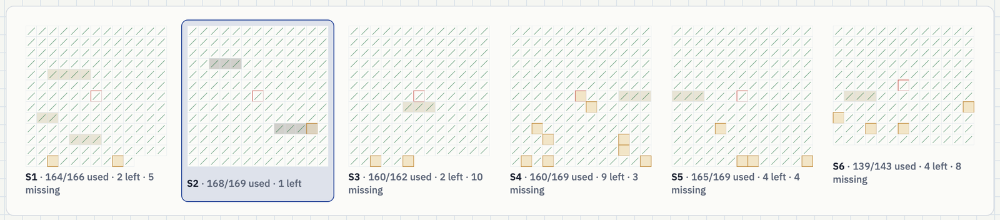
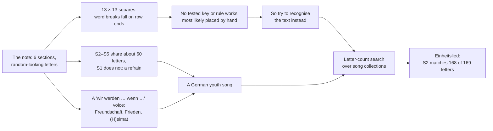
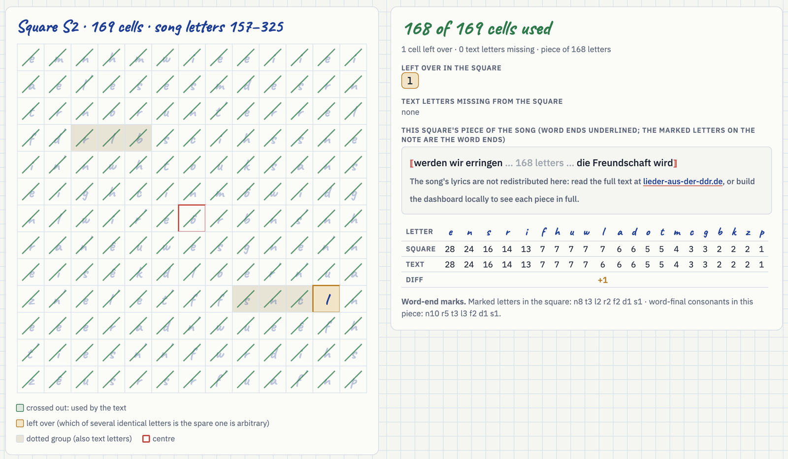
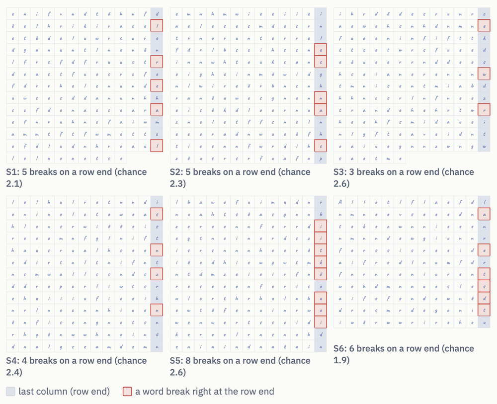
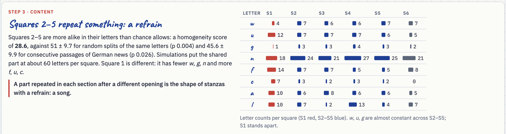
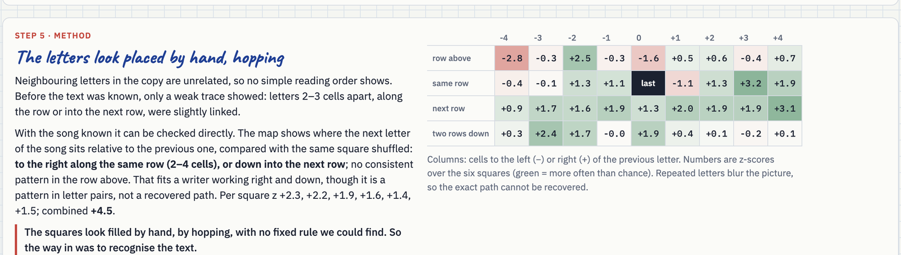

# The Baltiysk bottle note, solved

[](#the-proof)
[](https://scienceblogs.de/klausis-krypto-kolumne/2017/10/17/the-top-50-unsolved-encrypted-messages-19-the-kalinigrad-bottle-post/)
[](https://antalez.github.io/baltiysk-bottle-note/)
[](README.ru.md)
[](LICENSE)

*[Русская версия](README.ru.md) (AI-translated).*

<p align="center">
  
</p>

In 2015 workers digging a gas trench by Lenin Street 64–66 in Baltiysk (Kaliningrad region, Russia; formerly Pillau) found a bottle with two exercise-book sheets covered in letter groups that nobody could read: *"en'ifvn d't'öhn'fdê elhrikiracel etê deluwrs …"*. The find was [reported by *Strana Kaliningrad*](https://web.archive.org/web/20150907061615/http://strana39.ru/news/o-chem-govoryat/85709/v-baltiyske-obnaruzhili-cheburashku-s-poslaniem-.html) in July 2015, and the note became [No. 19 on Klaus Schmeh's list](https://scienceblogs.de/klausis-krypto-kolumne/2017/10/17/the-top-50-unsolved-encrypted-messages-19-the-kalinigrad-bottle-post/) of the most important unsolved encrypted messages.

**It is a song.** The note is the text of the GDR youth song **["Einheitslied"](https://lieder-aus-der-ddr.de/einheitslied/)** from the *Freundschaftskantate der Jugend* (words: Herbert Keller, music: [André Asriel](https://de.wikipedia.org/wiki/Andr%C3%A9_Asriel)). Its stanzas *Freundschaft! Allen Völkern Freundschaft …*, *Einheit! …* and the start of *Frieden! …* were cut into six consecutive pieces of about 169 letters. Each piece was written into a 13 × 13 square with its letters jumbled, and the squares were copied row by row with invented word breaks. Below the last square stands **"eimat"** followed by dots: most likely the end of *Heimat* (*"Singen soll die Heimat"*), which follows a few words after the last square's text.

<p align="center"><b><a href="https://antalez.github.io/baltiysk-bottle-note/">Open the interactive dashboard</a></b> · <a href="https://antalez.github.io/baltiysk-bottle-note/dashboard/#story">How it was found, step by step</a> · <a href="#the-proof">The proof</a> · <a href="https://antalez.github.io/baltiysk-bottle-note/dashboard/?lang=ru">По-русски</a></p>

<p align="center"></p>
<p align="center"><sub>The six squares of the note. Every cell whose letter is used by that square's piece of the song is crossed out; amber cells are left over. S2 uses 168 of its 169 cells.</sub></p>

## Contents
- [The story in one picture](#the-story-in-one-picture)
- [The proof](#the-proof)
- [Why this is not a coincidence](#why-this-is-not-a-coincidence)
- [How it was found](#how-it-was-found)
- [How the note was made](#how-the-note-was-made)
- [What is still open](#what-is-still-open)
- [Reproduce it yourself](#reproduce-it-yourself)
- [Sources and links](#sources-and-links)
- [Credits](#credits)

## The story in one picture



## The proof

Jumbling letters inside a square changes their order, not their counts. Cutting the song **once** into six back-to-back pieces (no overlaps, no gaps; [`src/partition.py`](src/partition.py)) and crossing out in each square the letters its piece uses:

| Square | Cells | Piece of the song (letters) | Left over in the square | Text letters missing |
|---|---|---|---|---|
| S1 | 166 | 0–157: *"Freundschaft! Allen Völkern Freundschaft …"* | d e e e i l l n s s t | f u |
| **S2** | **169** | **157–325**: *"…werden wir erringen, wenn wir fest zusammenstehn …"* | **l** | **none** |
| S3 | 162 | 325–495: *"…unser Deutschland ganz gehören … Einheit! …"* | e e | c c i i l n n r r u |
| S4 | 169 | 495–658: *"…wollen alle guten Menschen für das deutsche Land …"* | i i l l l l n n t | e e e |
| S5 | 169 | 658–827: *"…keine Bombe zerstören … Frieden!"* | d f n n | h i s u |
| S6 | 143 | 827–974: *"…Völkern Frieden … wenn wir fest zusammensteh(n)"* | a d s s | c m r r t u u u |

S2, letter by letter: all 168 letters of its piece are in the square; one *l* is left over.

```
letter   e   n   s   r   i   f   h   u   w   l   d   a   o   t   m   c   g   b   k   z   p
square  28  24  16  14  13   7   7   7   7   7   6   6   5   5   4   3   3   2   2   2   1
song    28  24  16  14  13   7   7   7   7   6   6   6   5   5   4   3   3   2   2   2   1
```

<p align="center"></p>

What remains in the other squares:

- **S1 probably starts with the song's title.** Without it, S1's piece has 157 letters for 166 cells, and 9 of the 11 left-over letters (*d e e e i l n s t*) are letters of the word *Einheitslied*; eleven random letters from S1 would share that many about 1 time in 400. With the title counted in front, as the dashboard does, S1 is 7 letters off instead of 13 ([`results/partition_with_title.txt`](results/partition_with_title.txt)).
- **S3 is short:** 162 cells for a 170-letter piece, so the writer dropped some letters.
- **The other squares differ by a few letters.** For S4 we checked on the 2015 scans: its extra *l* are clearly written *l*, so those differences are on the paper (copying slips, or the wording of the copy the writer used). The other squares have not been re-checked letter by letter.

## Why this is not a coincidence

All numbers below use one measure: letters left over in the square plus letters of the text missing from it.

- **Chance.** In 8.9 million letters of German news ([Leipzig corpus](https://wortschatz.uni-leipzig.de/en/download/German)), the best window for each square, chosen freely, leaves 20–36 letters unaccounted for (S2: 24). Allowed the same freedom of length as the song pieces (±25 letters), the best news windows still leave 19–33 (S2: 21). The song, cut once into consecutive pieces, a much stricter condition, leaves S2 1 and the others 8–13. This is a benchmark against ordinary German, not an exact false-positive probability ([`src/null_test.py`](src/null_test.py), [`results/null_test.txt`](results/null_test.txt)).
- **Other transcriptions.** A transcription [posted on d3.ru](https://simple_life.d3.ru/v-baltiiske-nashli-butylku-s-shifrovkoi-na-neizvestnom-iazyke-784251/) in July 2015 and [Thomas Ernst's of 2017](https://scienceblogs.de/klausis-krypto-kolumne/2017/10/17/the-top-50-unsolved-encrypted-messages-19-the-kalinigrad-bottle-post/) give the same result for S2 as ours (all 168 letters, one extra *l*). Ours started from Ernst's and was re-verified symbol by symbol ([`src/check_transcriptions.py`](src/check_transcriptions.py), [`results/check_transcriptions.txt`](results/check_transcriptions.txt)).
- **Order.** Each square's best-matching stretch, found independently, falls in the song's own order. If the six stretches could have landed anywhere independently, that order would come up 1 time in 720; the song's repeated refrain makes this figure approximate ([`src/significance.py`](src/significance.py)).
- **The marks.** The apostrophes match the word ends of each square's piece, so we read them as word-end marks. In S1, S3 and S4 no other stretch of the song matches a square's marked letters as well as its own piece (p ≈ 0.001 each); S2 p ≈ 0.01, S5 ≈ 0.07, S6 not significant ([`results/significance.txt`](results/significance.txt)).

## How it was found

Nobody guessed "a GDR song". The note itself showed what kind of text it was. The [dashboard's story tab](https://antalez.github.io/baltiysk-bottle-note/dashboard/#story) walks through it with charts; the numbers come from [`src/structure.py`](src/structure.py) ([`results/structure.txt`](results/structure.txt)).

**1. Squares.** The six sections hold 166, 169, 162, 169, 169 and 143 letters, and the invented word breaks land on the ends of 13-letter rows 31 times against about 14 by chance. Each section was a 13 × 13 square, copied out row by row.

<p align="center"></p>

**2. No key found.** Hundreds of grilles, routes and keyed transpositions, each first shown to recover planted German text, read nothing, and neighbouring letters are unrelated. That does not prove no key exists, but the simplest explanation is letters placed by hand. So instead of decrypting, we tried to **recognise** the text ([`docs/method.md`](docs/method.md)).

**3. A refrain.** Squares 2–5 are more alike in their letters than chance allows (p 0.004 against random splits, 0.03 against real German), sharing about 60 letters each, while square 1 stands apart. An opening followed by a repeated part is the shape of a song with a refrain.

<p align="center"></p>

**4. A voice.** The letters favour a collective German "wir werden … wenn …" ("we will … if …") voice with words like *Freundschaft*, *Frieden* and *Heimat*, and *eimat* stands under the last square. That pointed to a youth or Pioneer song.

**5. The search.** Letter counts survive any jumbling, so every square was compared, by counts, with every window of candidate texts. Bibles, German Wikisource, 475 books, the Soviet-German newspaper *Freundschaft*, 11,178 German folk songs and Russian songs gave nothing. A collection of 1,762 songs and poems, most of them from the GDR song archive [lieder-aus-der-ddr.de](https://lieder-aus-der-ddr.de/), contained the Einheitslied.

We got things wrong on the way (spelling-habit theories, a Russian "private alphabet", words "read" by decoders), and we searched GDR songs later than the clues deserved. The dashboard lists these too.

## How the note was made

- **Pieces.** The song's letters (no spaces or punctuation; the writer kept *ö* and *ü*) cut into consecutive pieces of about 169 = 13 × 13. S1 probably begins with the title *Einheitslied* (see [the proof](#the-proof)).
- **Filling.** Each piece written into its square with the letters jumbled. Consecutive song letters turn up 2–4 cells to the right in the same row, or in the next row down, more often than chance, with no consistent pattern in the row above. This holds in every square and is clear in combination. It fits a writer working right and down through the square, but it is a pattern in letter pairs, not a recovered writing path: the song repeats letters too much for the exact order to be reconstructed.

<p align="center"></p>

- **Word ends marked.** The apostrophes match the last letters of words (*t′* ends *Freundschaft*, *Einheit*, *Welt*; *n′* ends *allen*, *wollen*, *singen* …); *ê* matches a word-final *e* ([`results/marks.txt`](results/marks.txt)).
- **Copied** row by row onto the two sheets with invented word breaks; each square's last letter underlined.
- **Dotted groups** (*r.s.f.d. c.f. f.t′.f.*, *r.l.b. s.n.c.*, …): letters of the song placed in reserved cells around each square's centre.

## What is still open

- **The dotted groups.** 27 consonants from only ten letters (b c d f l n r s t z), placed around the squares' centres. In S2 the second group is the first shifted by one letter in that alphabet, which suggests numbers in a ten-letter code: perhaps a date, a class or a school number. One outside fact would fix the code.
- **The remaining letter differences** in S1 and S3–S6. They are not skipped or swapped words, and not a misplaced square boundary. They pair up as cursive look-alikes, mostly *e* and *l* in both directions, more often than random slips do (p ≈ 0.07): most likely the writer copied the song from someone's handwritten copy and misread a few letters ([`src/leftovers.py`](src/leftovers.py), [`results/leftovers.txt`](results/leftovers.txt)).
- **The author.** No name is written. Someone who knew a GDR youth song well, and buried it in Baltiysk.

Details: [`docs/open_questions.md`](docs/open_questions.md). If you know anything about this song in Baltiysk, a GDR songbook with it, or the bottle itself, please open an issue.

## Reproduce it yourself

```bash
pip install numpy
python src/fetch_song.py           # downloads the lyrics to data/song.txt (not redistributed here)
cd src
python squares.py                  # the six squares
python partition.py                # the song cut once into six pieces; left over / missing per square
python verify.py                   # each square's best stretch, found independently
python marks.py                    # apostrophes vs word ends
python significance.py             # order and marks tests
python check_transcriptions.py     # S2 in the 2015 transcription
python null_test.py                # chance baseline (downloads ~30 MB of German news)
python sieve.py ../data/song.txt   # the letter-count search (or any folder of .txt files)
python structure.py                # what the note itself shows: rows of 13, dotted groups, the refrain, the letter mix, the hops
python leftovers.py                # where the leftover letters come from: word edits, square boundaries, cursive look-alikes
```

The [live dashboard](https://antalez.github.io/baltiysk-bottle-note/) shows short excerpts of the song only. To see each square's whole piece of the song, build it locally:

```bash
python src/fetch_song.py && python src/fetch_photos.py   # lyrics and the two public photos, saved locally (not redistributed)
cd src && python structure.py && python build_dashboard.py
open ../dashboard/index.html                                # or double-click it
```

**Files:**
- [`transcript/transcript_v3.4.txt`](transcript/transcript_v3.4.txt): the note, line by line; [`transcript/NOTATION.md`](transcript/NOTATION.md) explains the notation; [`transcript/earlier/`](transcript/earlier/) holds the 2015 forum transcription.
- [`src/`](src/): the scripts above; [`results/`](results/): their output; [`dashboard/`](dashboard/): the interactive page.
- [`docs/method.md`](docs/method.md): what was tried, what failed and why, and how the solution was confirmed.
- [`docs/open_questions.md`](docs/open_questions.md): the dotted groups, the remaining differences, the author.
- [`README.ru.md`](README.ru.md), [`docs/method.ru.md`](docs/method.ru.md), [`docs/open_questions.ru.md`](docs/open_questions.ru.md): Russian versions (AI-translated).

## Sources and links

- **The find:** *Strana Kaliningrad*, No. 27, 1–7 July 2015 ([archived web article](https://web.archive.org/web/20150907061615/http://strana39.ru/news/o-chem-govoryat/85709/v-baltiyske-obnaruzhili-cheburashku-s-poslaniem-.html)).
- **The case:** Klaus Schmeh, ["Kaliningrad's second mystery: who can break this encrypted bottle post?"](https://scienceblogs.de/klausis-krypto-kolumne/2016/09/12/kaliningrads-second-mystery-who-can-break-this-encrypted-bottle-post/) (2016, with the photographs) and ["The Top 50 unsolved encrypted messages: 19. The Kaliningrad bottle post"](https://scienceblogs.de/klausis-krypto-kolumne/2017/10/17/the-top-50-unsolved-encrypted-messages-19-the-kalinigrad-bottle-post/) (2017, with Thomas Ernst's transcription in the comments).
- **The 2015 transcription:** [d3.ru thread](https://simple_life.d3.ru/v-baltiiske-nashli-butylku-s-shifrovkoi-na-neizvestnom-iazyke-784251/) (comments).
- **The song:** ["Einheitslied (aus der Freundschaftskantate der Jugend)"](https://lieder-aus-der-ddr.de/einheitslied/) at lieder-aus-der-ddr.de; composer [André Asriel](https://de.wikipedia.org/wiki/Andr%C3%A9_Asriel).
- **German reference text:** [Leipzig Corpora Collection](https://wortschatz.uni-leipzig.de/en/download/German), German news 2020.

## Credits

Solved by Anton Zaytsev (October 2026), with AI assistance (Claude, Anthropic).
Thanks to the 2015 transcriber on d3.ru and to Thomas Ernst (2017) for earlier transcriptions; to Klaus Schmeh for keeping the case alive; to *Strana Kaliningrad* for the original report; and to *lieder-aus-der-ddr.de* for preserving the song.

The song lyrics are © their rights holders and are not included in this repository. Code: [MIT licence](LICENSE). Text and tables: CC BY 4.0.
