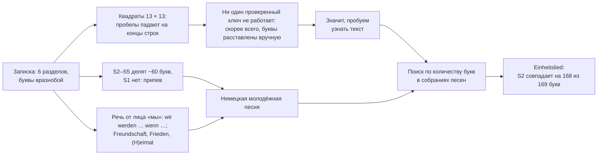

# Записка из бутылки в Балтийске: расшифрована

[](#доказательство)
[](https://scienceblogs.de/klausis-krypto-kolumne/2017/10/17/the-top-50-unsolved-encrypted-messages-19-the-kalinigrad-bottle-post/)
[](https://antalez.github.io/baltiysk-bottle-note/)
[](README.md)

*Перевод с английского выполнен с помощью ИИ (Claude). При расхождениях верна [английская версия](README.md).*

<p align="center">
  
</p>

В 2015 году рабочие копали траншею под газопровод у дома 64–66 по улице Ленина в Балтийске (Калининградская область, бывший Пиллау) и нашли бутылку. Внутри были два тетрадных листа, исписанные группами букв, которые никто не смог прочесть: *"en'ifvn d't'öhn'fdê elhrikiracel etê deluwrs …"*. О находке [написала газета «Страна Калининград»](https://web.archive.org/web/20150907061615/http://strana39.ru/news/o-chem-govoryat/85709/v-baltiyske-obnaruzhili-cheburashku-s-poslaniem-.html) в июле 2015 года, а записка заняла [19-е место в списке Клауса Шмеха](https://scienceblogs.de/klausis-krypto-kolumne/2017/10/17/the-top-50-unsolved-encrypted-messages-19-the-kalinigrad-bottle-post/) важнейших нерасшифрованных сообщений.

**Это песня.** В записке записан текст песни ГДР **[«Einheitslied»](https://lieder-aus-der-ddr.de/einheitslied/)** («Песня единства») из *Freundschaftskantate der Jugend* («Кантата дружбы молодёжи»; слова Херберта Келлера, музыка [Андре Асриэля](https://de.wikipedia.org/wiki/Andr%C3%A9_Asriel)). Её куплеты *Freundschaft! Allen Völkern Freundschaft …*, *Einheit! …* и начало куплета *Frieden! …* разрезаны на шесть идущих подряд кусков примерно по 169 букв. Каждый кусок вписан в квадрат 13 × 13, буквы внутри квадрата перемешаны, затем квадраты переписаны по строкам с придуманными пробелами между «словами». Под последним квадратом стоит **«eimat»** и точки. Скорее всего, это конец слова *Heimat* («Родина»; в песне *«Singen soll die Heimat»*), которое идёт в тексте через несколько слов после последнего квадрата.

<p align="center"><b><a href="https://antalez.github.io/baltiysk-bottle-note/">Открыть интерактивную страницу</a></b> · <a href="https://antalez.github.io/baltiysk-bottle-note/dashboard/#story">Как нашли, по шагам</a> · <a href="#доказательство">Доказательство</a><br><sub>Интерактивная страница на английском.</sub></p>

<p align="center"></p>
<p align="center"><sub>Шесть квадратов записки. Вычеркнута каждая клетка, чью букву использует кусок песни этого квадрата; жёлтым отмечено лишнее. В S2 использовано 168 клеток из 169.</sub></p>

## Содержание
- [История на одной картинке](#история-на-одной-картинке)
- [Доказательство](#доказательство)
- [Почему это не совпадение](#почему-это-не-совпадение)
- [Как её нашли](#как-её-нашли)
- [Как была сделана записка](#как-была-сделана-записка)
- [Что остаётся открытым](#что-остаётся-открытым)
- [Как проверить самому](#как-проверить-самому)
- [Источники и ссылки](#источники-и-ссылки)
- [Авторы](#авторы)

## История на одной картинке



## Доказательство

Перемешивание букв внутри квадрата меняет их порядок, но не количество. Разрежем песню **один раз** на шесть кусков подряд, без перекрытий и пропусков ([`src/partition.py`](src/partition.py)), и вычеркнем в каждом квадрате буквы, которые использует его кусок:

| Квадрат | Клеток | Кусок песни (номера букв) | Лишнее в квадрате | Не хватает букв текста |
|---|---|---|---|---|
| S1 | 166 | 0–157: *"Freundschaft! Allen Völkern Freundschaft …"* | d e e e i l l n s s t | f u |
| **S2** | **169** | **157–325**: *"…werden wir erringen, wenn wir fest zusammenstehn …"* | **l** | **нет** |
| S3 | 162 | 325–495: *"…unser Deutschland ganz gehören … Einheit! …"* | e e | c c i i l n n r r u |
| S4 | 169 | 495–658: *"…wollen alle guten Menschen für das deutsche Land …"* | i i l l l l n n t | e e e |
| S5 | 169 | 658–827: *"…keine Bombe zerstören … Frieden!"* | d f n n | h i s u |
| S6 | 143 | 827–974: *"…Völkern Frieden … wenn wir fest zusammensteh(n)"* | a d s s | c m r r t u u u |

S2 по буквам: все 168 букв его куска есть в квадрате, одна *l* лишняя.

```
буква    e   n   s   r   i   f   h   u   w   l   d   a   o   t   m   c   g   b   k   z   p
квадрат 28  24  16  14  13   7   7   7   7   7   6   6   5   5   4   3   3   2   2   2   1
песня   28  24  16  14  13   7   7   7   7   6   6   6   5   5   4   3   3   2   2   2   1
```

<p align="center"></p>

Что остаётся в других квадратах:

- **S1, вероятно, начинается с названия песни.** Без него кусок S1 содержит 157 букв на 166 клеток, и 9 из 11 лишних букв (*d e e e i l n s t*) входят в слово *Einheitslied*; у 11 случайных букв S1 столько совпадений бывает примерно в 1 случае из 400. Если считать название перед S1, как это делает интерактивная страница, S1 расходится на 7 букв вместо 13 ([`results/partition_with_title.txt`](results/partition_with_title.txt)).
- **S3 короче:** 162 клетки на кусок из 170 букв, автор пропустил несколько букв.
- **Остальные квадраты расходятся на несколько букв.** Для S4 мы проверили по сканам 2015 года: лишние *l* написаны чётко, это именно *l*. Значит, расхождения есть на самой бумаге (описки автора или другая редакция текста, с которой переписывал автор). Остальные квадраты буква за буквой не перепроверялись.

## Почему это не совпадение

Все числа ниже считаются одной мерой: лишние буквы в квадрате плюс буквы текста, которых в квадрате нет.

- **Случайность.** В 8,9 млн букв немецких новостей ([корпус Лейпцигского университета](https://wortschatz.uni-leipzig.de/en/download/German)) лучший отрезок для каждого квадрата, выбранный свободно, оставляет 20–36 несовпадающих букв (для S2 24). Если дать отрезкам новостей ту же свободу длины, что и кускам песни (±25 букв), лучшие всё равно оставляют 19–33 (для S2 21). Песня, разрезанная один раз на куски подряд (условие гораздо строже), оставляет для S2 одну букву, для остальных 8–13. Это сравнение с обычным немецким текстом, а не точная вероятность ложного совпадения ([`src/null_test.py`](src/null_test.py), [`results/null_test.txt`](results/null_test.txt)).
- **Другие расшифровки.** [Транскрипция с сайта d3.ru](https://simple_life.d3.ru/v-baltiiske-nashli-butylku-s-shifrovkoi-na-neizvestnom-iazyke-784251/) (июль 2015) и [транскрипция Томаса Эрнста](https://scienceblogs.de/klausis-krypto-kolumne/2017/10/17/the-top-50-unsolved-encrypted-messages-19-the-kalinigrad-bottle-post/) (2017) дают для S2 тот же результат, что и наша: все 168 букв и одна лишняя *l*. Наша транскрипция начиналась с транскрипции Эрнста и была заново проверена знак за знаком ([`src/check_transcriptions.py`](src/check_transcriptions.py), [`results/check_transcriptions.txt`](results/check_transcriptions.txt)).
- **Порядок.** Лучший отрезок песни для каждого квадрата, найденный независимо, идёт в том же порядке, что и в песне. Если бы шесть отрезков могли оказаться где угодно независимо друг от друга, такой порядок выпадал бы 1 раз из 720; повторяющийся припев делает эту оценку приблизительной ([`src/significance.py`](src/significance.py)).
- **Пометки.** Апострофы совпадают с концами слов в куске песни каждого квадрата, поэтому мы читаем их как пометки концов слов. В S1, S3 и S4 никакой другой отрезок песни не совпадает с помеченными буквами квадрата так хорошо, как его собственный кусок (p ≈ 0,001 для каждого); для S2 p ≈ 0,01, для S5 ≈ 0,07, для S6 незначимо ([`results/significance.txt`](results/significance.txt)).

## Как её нашли

Никто не угадывал «песню ГДР». Сама записка показала, что это за текст. [Вкладка истории на интерактивной странице](https://antalez.github.io/baltiysk-bottle-note/dashboard/#story) проходит по шагам с графиками; числа считает [`src/structure.py`](src/structure.py) ([`results/structure.txt`](results/structure.txt)).

**1. Квадраты.** В шести разделах 166, 169, 162, 169, 169 и 143 буквы, а придуманные пробелы попадают на концы 13-буквенных строк 31 раз при примерно 14 случайных. Каждый раздел был квадратом 13 × 13, переписанным по строкам.

<p align="center"></p>

**2. Ключ не найден.** Сотни решёток, маршрутов и перестановок по ключу, каждую из которых сначала проверили на подложенном немецком тексте, ничего не прочли, а соседние буквы между собой не связаны. Это не доказывает, что ключа нет, но самое простое объяснение: буквы расставлены вручную. Поэтому вместо расшифровки мы попробовали **узнать** текст ([`docs/method.ru.md`](docs/method.ru.md)).

**3. Припев.** Квадраты 2–5 похожи друг на друга по составу букв больше, чем допускает случай (p 0,004 против случайных разбиений, 0,03 против настоящего немецкого текста): у них около 60 общих букв на квадрат, а квадрат 1 стоит отдельно. Вступление и повторяющаяся часть: так устроена песня с припевом.

<p align="center"></p>

**4. Голос.** Буквы указывают на немецкую речь от лица «мы» («wir werden … wenn …», «мы будем … если …») со словами вроде *Freundschaft* (дружба), *Frieden* (мир) и *Heimat* (родина), а под последним квадратом стоит *eimat*. Это указывало на песню пионерского или молодёжного типа.

**5. Поиск.** Количество букв не меняется при любом перемешивании, поэтому каждый квадрат сравнивался по количеству букв со всеми отрезками текстов-кандидатов. Библия, немецкий Викитекст, 475 книг, советско-немецкая газета *Freundschaft*, 11 178 немецких народных песен и русские песни ничего не дали. Песня нашлась в собрании из 1 762 песен и стихов, большая часть которого взята из архива песен ГДР [lieder-aus-der-ddr.de](https://lieder-aus-der-ddr.de/).

По пути мы ошибались («привычки написания», «собственный алфавит» поверх русского, слова, «прочитанные» декодерами), а песни ГДР начали искать позже, чем следовало по признакам. На интерактивной странице это тоже перечислено.

## Как была сделана записка

- **Куски.** Буквы песни (без пробелов и знаков препинания; *ö* и *ü* автор сохранил) разрезаны на куски подряд примерно по 169 = 13 × 13 букв. S1, вероятно, начинается с названия *Einheitslied* (см. [доказательство](#доказательство)).
- **Заполнение.** Каждый кусок вписан в свой квадрат с перемешанными буквами. Соседние буквы песни чаще случайного оказываются на 2–4 клетки правее в той же строке или в следующей строке а в строке выше устойчивой закономерности нет. Это видно в каждом квадрате и ясно видно в сумме. Это похоже на автора, который двигался по квадрату вправо и вниз, но это закономерность в парах букв, а не восстановленный путь: в песне слишком много повторяющихся букв, чтобы восстановить точный порядок записи.

<p align="center"></p>

- **Концы слов помечены.** Апострофы совпадают с последними буквами слов (*t′* в конце *Freundschaft*, *Einheit*, *Welt*; *n′* в конце *allen*, *wollen*, *singen* …); *ê* совпадает с *e* в конце слова ([`results/marks.txt`](results/marks.txt)).
- **Переписано** по строкам на два листа с придуманными пробелами; последняя буква каждого квадрата подчёркнута.
- **Группы с точками** (*r.s.f.d. c.f. f.t′.f.*, *r.l.b. s.n.c.*, …): буквы песни в заранее оставленных клетках вокруг центра квадрата.

## Что остаётся открытым

- **Группы с точками.** 27 согласных всего из десяти букв (b c d f l n r s t z), расставленных вокруг центров квадратов. В S2 вторая группа это первая, сдвинутая на одну букву в этом алфавите: похоже на числа, записанные кодом из десяти букв, например дату, класс или номер школы. Один внешний факт позволил бы восстановить код.
- **Оставшиеся расхождения** в S1 и S3–S6: описки автора или печатная редакция песни, отличающаяся от опубликованной в интернете.
- **Автор.** Имени нет. Человек, хорошо знавший молодёжную песню ГДР и закопавший её в Балтийске.

Подробнее: [`docs/open_questions.ru.md`](docs/open_questions.ru.md). Если вы что-то знаете об этой песне в Балтийске, о песеннике ГДР с ней или о самой бутылке, пожалуйста, откройте issue.

## Как проверить самому

```bash
pip install numpy
python src/fetch_song.py           # скачивает текст песни в data/song.txt (в репозитории его нет)
cd src
python squares.py                  # шесть квадратов
python partition.py                # песня, разрезанная один раз на шесть кусков; лишнее и недостающее в каждом квадрате
python verify.py                   # лучший отрезок песни для каждого квадрата, найденный независимо
python marks.py                    # апострофы и концы слов
python significance.py             # проверка порядка и пометок
python check_transcriptions.py     # S2 по транскрипции 2015 года
python null_test.py                # проверка на случайность (скачивает ~30 МБ немецких новостей)
python sieve.py ../data/song.txt   # поиск по количеству букв (или любая папка с .txt)
python structure.py                # что видно в самой записке: строки по 13, группы с точками, припев, состав букв, ходы
```

[Интерактивная страница онлайн](https://antalez.github.io/baltiysk-bottle-note/) показывает только короткие отрывки песни. Чтобы увидеть кусок песни каждого квадрата целиком, соберите её локально:

```bash
python src/fetch_song.py && python src/fetch_photos.py   # текст песни и две опубликованные фотографии, сохраняются локально (не распространяются)
cd src && python structure.py && python build_dashboard.py
open ../dashboard/index.html                                # или откройте файл двойным щелчком
```

**Файлы:**
- [`transcript/transcript_v3.4.txt`](transcript/transcript_v3.4.txt): записка построчно; [`transcript/NOTATION.md`](transcript/NOTATION.md) объясняет обозначения; в [`transcript/earlier/`](transcript/earlier/) лежит транскрипция 2015 года с форума.
- [`src/`](src/): скрипты выше; [`results/`](results/): их вывод; [`dashboard/`](dashboard/): интерактивная страница.
- [`docs/method.ru.md`](docs/method.ru.md): что пробовали, что не сработало и почему, как подтвердили решение.
- [`docs/open_questions.ru.md`](docs/open_questions.ru.md): группы с точками, оставшиеся расхождения, автор.

## Источники и ссылки

- **Находка:** «Страна Калининград», № 27, 1–7 июля 2015 ([архив веб-статьи](https://web.archive.org/web/20150907061615/http://strana39.ru/news/o-chem-govoryat/85709/v-baltiyske-obnaruzhili-cheburashku-s-poslaniem-.html)).
- **Загадка:** Клаус Шмех, ["Kaliningrad's second mystery: who can break this encrypted bottle post?"](https://scienceblogs.de/klausis-krypto-kolumne/2016/09/12/kaliningrads-second-mystery-who-can-break-this-encrypted-bottle-post/) (2016, с фотографиями) и ["The Top 50 unsolved encrypted messages: 19. The Kaliningrad bottle post"](https://scienceblogs.de/klausis-krypto-kolumne/2017/10/17/the-top-50-unsolved-encrypted-messages-19-the-kalinigrad-bottle-post/) (2017, транскрипция Томаса Эрнста в комментариях).
- **Транскрипция 2015 года:** [обсуждение на d3.ru](https://simple_life.d3.ru/v-baltiiske-nashli-butylku-s-shifrovkoi-na-neizvestnom-iazyke-784251/) (в комментариях).
- **Песня:** ["Einheitslied (aus der Freundschaftskantate der Jugend)"](https://lieder-aus-der-ddr.de/einheitslied/) на lieder-aus-der-ddr.de; композитор [Андре Асриэль](https://de.wikipedia.org/wiki/Andr%C3%A9_Asriel).
- **Немецкий текст для сравнения:** [Leipzig Corpora Collection](https://wortschatz.uni-leipzig.de/en/download/German), немецкие новости 2020.

## Авторы

Расшифровал Антон Зайцев (октябрь 2026) с помощью ИИ (Claude, Anthropic).
Спасибо автору транскрипции 2015 года на d3.ru и Томасу Эрнсту (2017) за более ранние транскрипции; Клаусу Шмеху за то, что не дал делу забыться; газете «Страна Калининград» за первую публикацию; сайту *lieder-aus-der-ddr.de* за сохранённую песню.

Права на текст песни принадлежат правообладателям; в репозитории его нет. Код: [лицензия MIT](LICENSE). Тексты и таблицы: CC BY 4.0.
